# kaseiCoin

## Background

 

We will be developing a new monetary system for the first human colony on Mars. Accordingly, it was decided that the new system would use blockchain technology with the new cryptocurrency named KasiCoin.

 

## Assignment Screenshots

 

## Successful compilation of Smart Contracts

 

The screenshots below show the successful compilation of the KaseiCoin, KaseioinCrowdsale and KaseiCoinCrowdsaleDeployer contracts respectively.

 

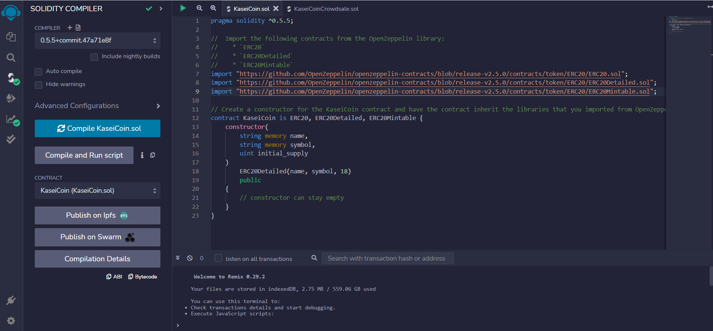

 

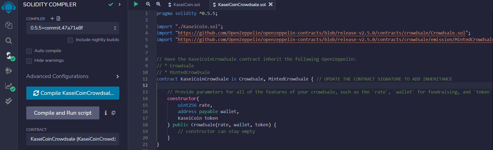

 

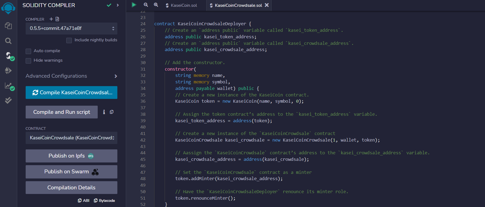

 

## Deployment of the KaseiCoinCrowdsale Contract using Ganache and Metamask

 

After linking our ethereum account via metamask to remix, we then deployed the KaseicoinCrowdsaleDeployer Smart Contract.

 

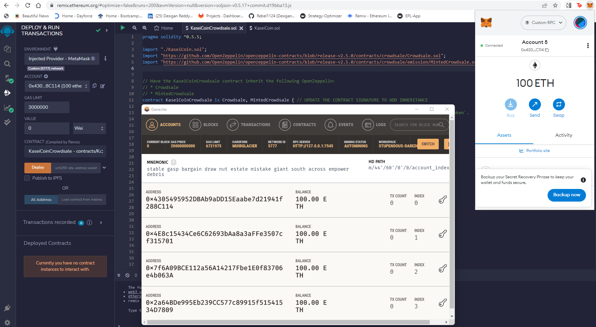

 

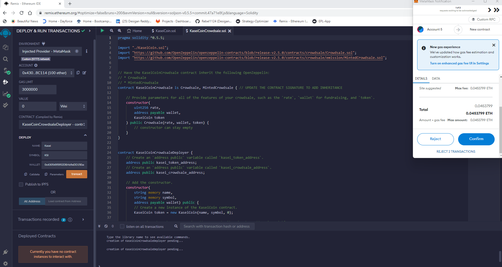

 

## KaseiCoinCrowdsale Deployed Contract

 

After successfully deploying the contracts, we are able to see the addresses for the kasei_crowdsale and kasei_tokens. We also see the contract that allows us to buy tokens and to see the wei raised.

 

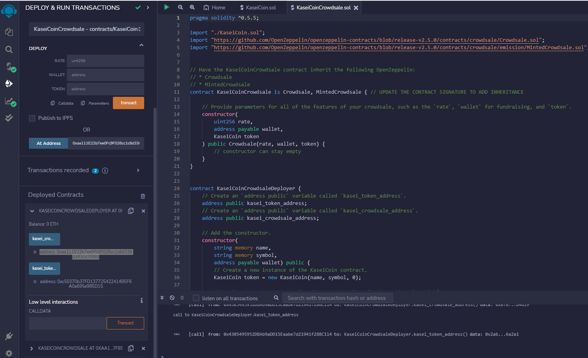

 

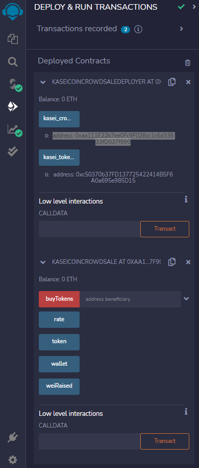

 

## Kasei Coin Deployed Contract

 

Next we mint the Kasei Coin tokens and after minting we are able to see the balance of coins for an address as well as the totalSupply of Kasei Coins.

 

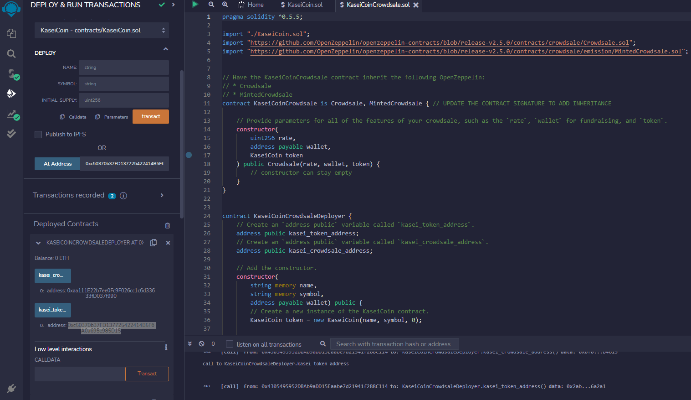

 

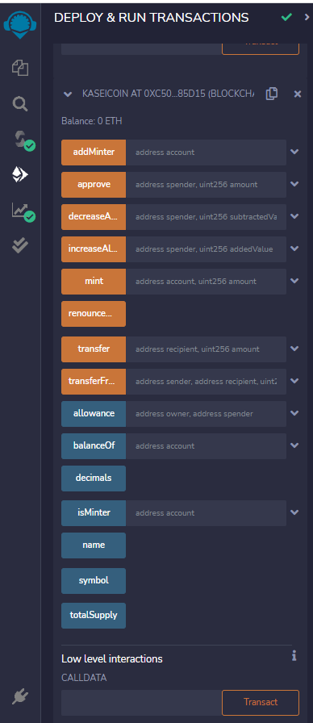

 

## Mint (Buy) Kasei Coin Tokens

 

Next, we test our smart contract buy minting (buying) 5 Kasei Coins (1 KSI = 1 ETH) and see the ether as well as gas fees being paid from our metamask account.

 

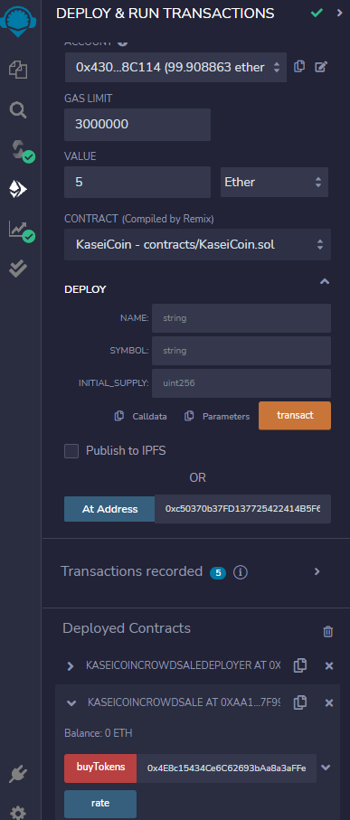

 

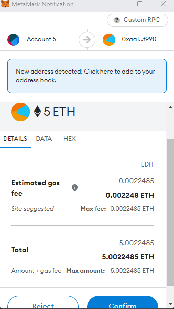

 

## Mint (Buy) Kasei Coin Tokens

 

Lastly after minting/buying the 5 Kasei Coins, we then check for the wei raised as well as the total supply of Kasei Coins.

 

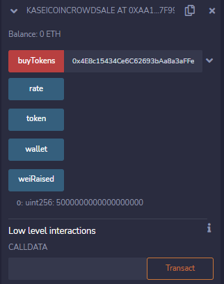

 

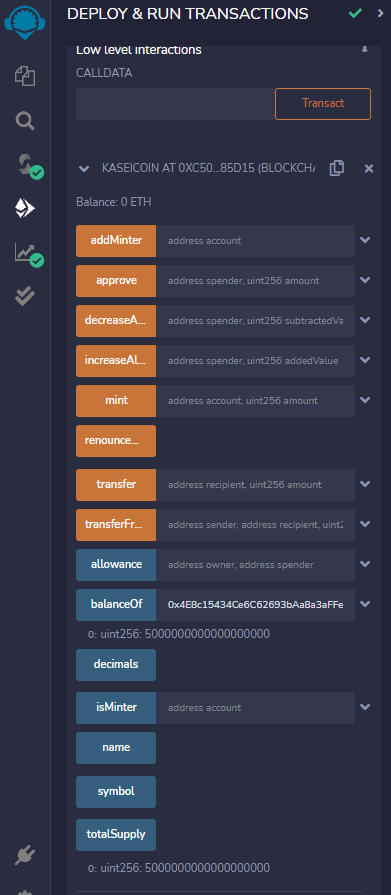

 